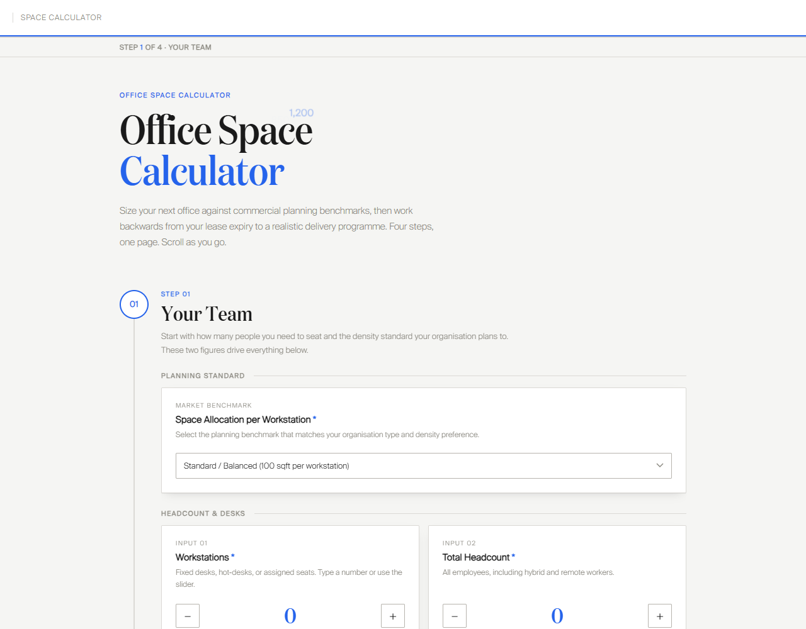
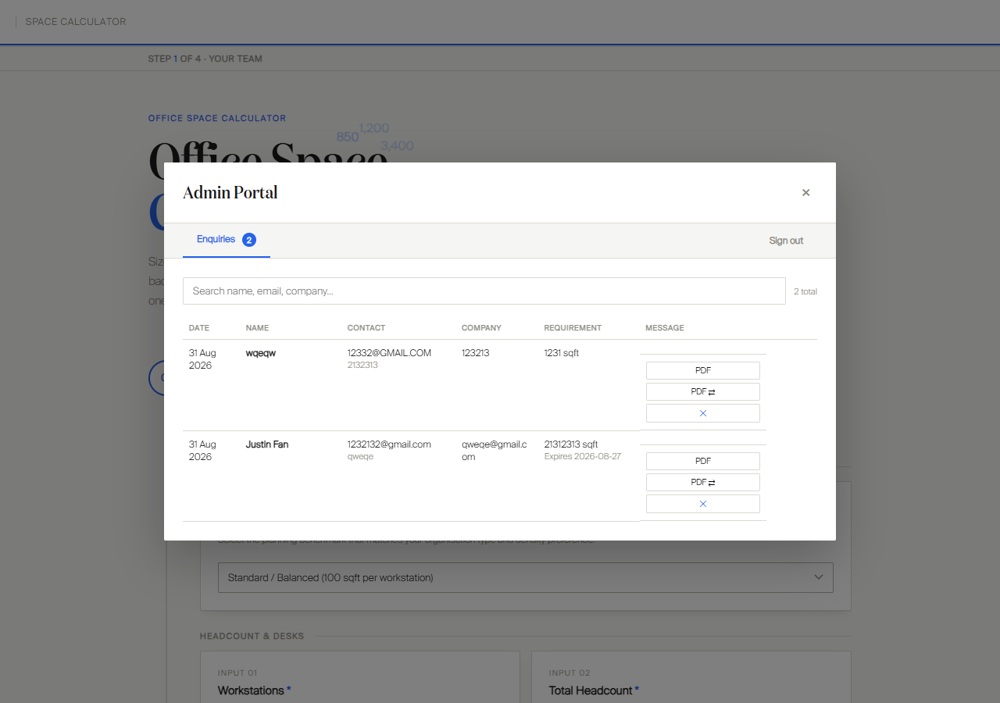

# Office Space Calculator

An office space planning tool that estimates required office footprint against commercial planning benchmarks and lays out a backwards-phased relocation programme from the lease expiry date — with lease enquiry capture and a login-protected admin portal for managing enquiries and generating per-enquirer PDF reports.

> **Note:** This is a portfolio showcase. The source code lives in a private repository.

## What it does

- **Space calculator** — step-by-step wizard covering planning standard, workstation count, headcount, meeting rooms and support spaces, producing an itemised footprint breakdown
- **Project programme** — a Gantt timeline phased backwards from lease expiry across six project stages (audit → go to market → negotiation → fit-out planning → construction → reinstatement), so users see exactly when they need to start
- **Lease enquiry form** — "Have an existing lease?" captures contact details, lease expiry and current space for advisory follow-up, with optional email alerts via Resend
- **PDF report** — a one-page branded report with the space breakdown, programme timeline and contact card, generated per calculation or per enquirer from the admin portal
- **Admin portal** — login-protected panel to view, search and delete enquiries

## Tech & architecture

- **Frontend:** a single self-contained HTML page — embedded fonts, inline CSS and vanilla JavaScript, no framework, no build step
- **Backend:** Node.js + Express handling auth, enquiry CRUD and email notifications
- **Data:** Supabase (Postgres) for enquiries and an admin audit log — the server refuses to start without a database connection
- **Deploy:** Render.com via a `render.yaml` blueprint (infrastructure as code) — connect the repo and Render configures everything

## How it works

The wizard gates progression per step and re-runs a single calculation core on every change, so the on-screen report and the PDF can never drift. The timeline engine takes one input — lease expiry — and subtracts each phase's duration in sequence to place the six stages on the Gantt chart. Enquiries post to a rate-limited public endpoint; everything else behind the gear icon requires an authenticated admin session.

## Security

- Signed, expiring tokens in `HttpOnly` cookies, verified server-side on every admin request
- Constant-time password comparison and progressive delay after failed sign-in attempts
- Rate limiting on enquiry submissions (per-IP and a global hourly ceiling)
- Helmet security headers with a strict Content-Security-Policy and request body-size limits
- No default credentials — admin credentials come from the environment, and development generates a random passcode per boot
